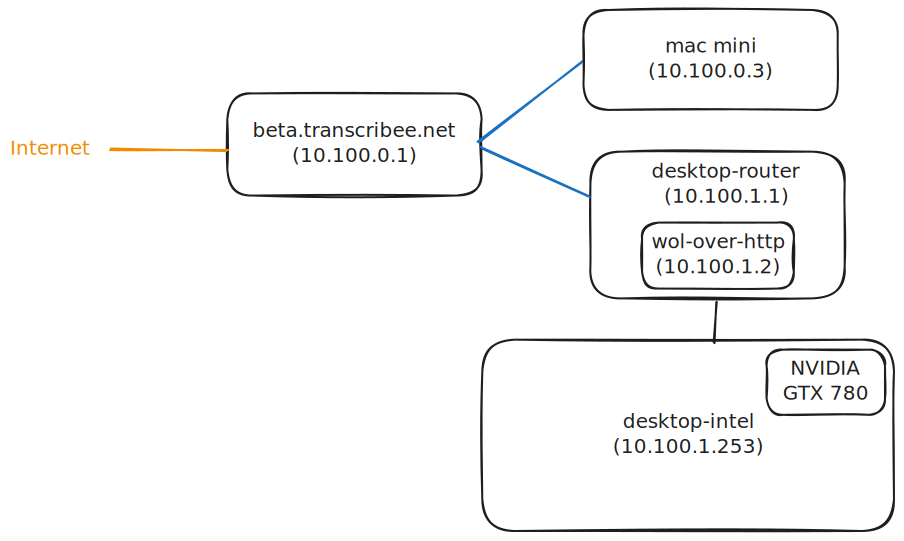

# Bugbakery Test Farm

This repository contains tools and documentation for the bugbakery setup for testing cross platform
desktop software.


## Setup

We have an internal wireguard network that connects most of our infrastructure. Our desktop
testing machines are located behind a router that terminates the wireguard network.
Our desktop testing machines are hosting virtual machines that are then used for testing.



## Usage

To spawn virtual machines and connect to them do (for example):

```sh
uv run main.py win11+intel
```
